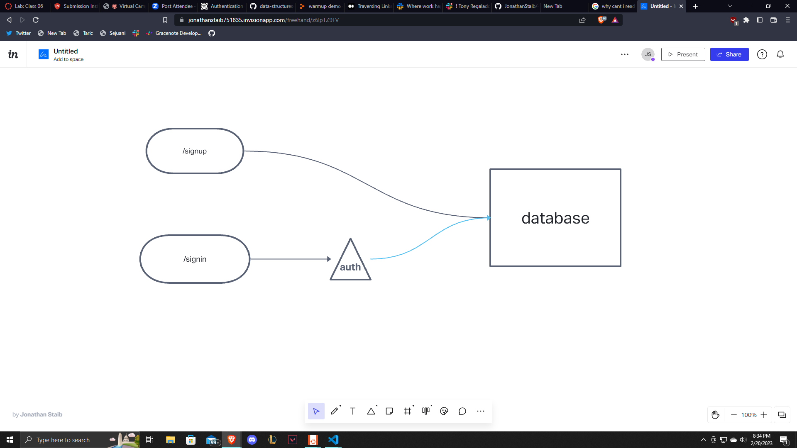

# LAB - Class 06

## Project: Basic-Auth

### Author: Jonathan Staib

### Problem Domain  

Deploy an Express server that implements Basic Authentication, with signup and signin capabilities, using a Postgres database for storage.

### Links and Resources

- can only have one database on render

### Setup

#### `.env` requirements (where applicable)

PORT
DATABASE_URL

#### How to initialize/run your application (where applicable)

- e.g. `npm start`

#### How to use your library (where applicable)

#### Features / Routes

- `/signin`
- `/signup`

#### Tests

- How do you run tests?

  npm test with jest and supertest
  
POST to /signup to create a new user.
POST to /signin to login as a user (use basic auth).
Need tests for auth middleware and the routes.
Does the middleware function (send it a basic header).
Do the routes assert the requirements (signup/signin).

- Describe any tests that you did not complete, skipped, etc
  All done.

#### UML

